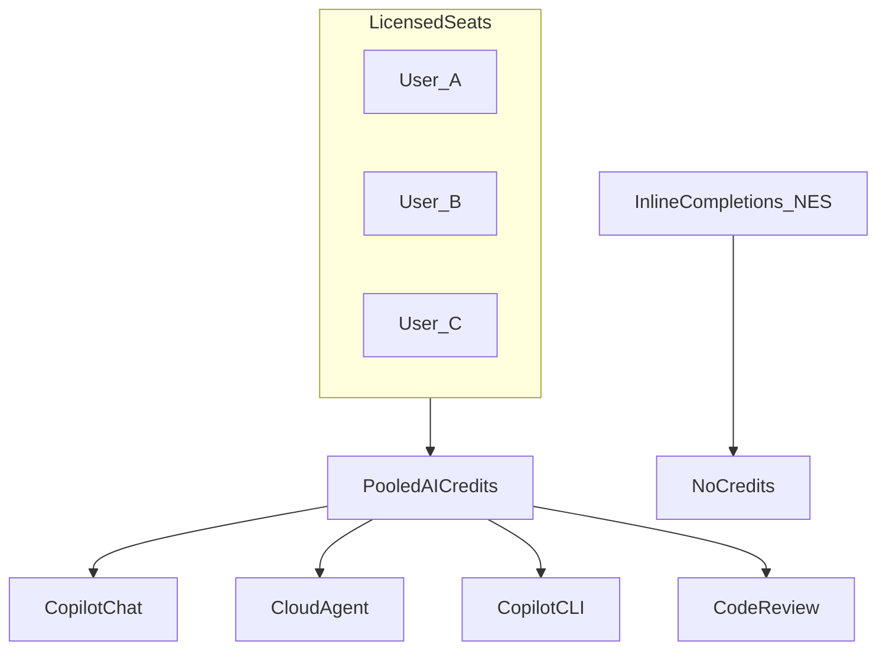
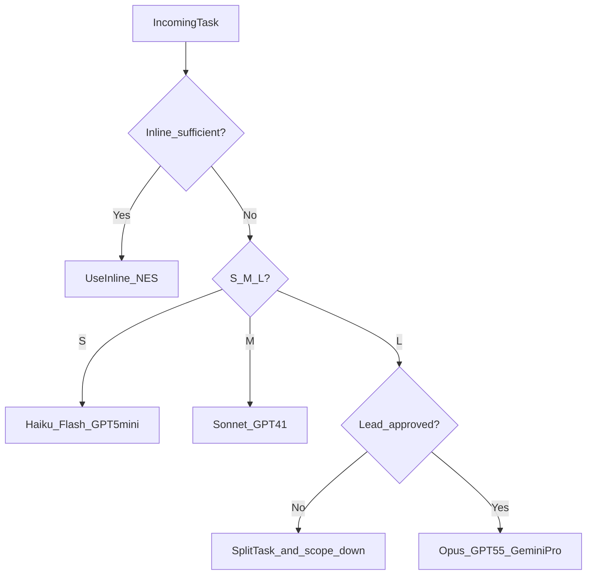
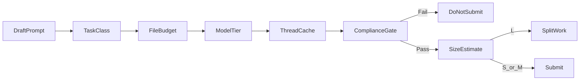
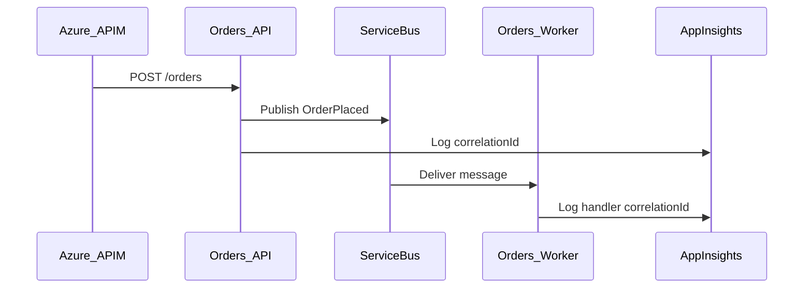

# GitHub Tokensaver: Enterprise Copilot Under Usage-Based Billing

**Thesis:** Efficient prompting is no longer just about getting the right answer; it is about **token financial management**, **data security**, and **architectural alignment**.

This repository trains enterprise engineering teams to maximize GitHub Copilot productivity under the **June 2026 Usage-Based Billing (UBB)** system—pooled **GitHub AI Credits**, per-token model rates, and organizational budget controls—while adhering to corporate governance, compliance, and **Azure NorthStar** cloud architecture standards.

| Resource | Purpose |
|----------|---------|
| [INSTALL.md](INSTALL.md) | **Copy this kit into any repo** — instructions + `.copilotignore` |
| [examples/](examples/) | Hands-on cache-friendly and anti-pattern exercises |
| [.github/copilot-instructions.md](.github/copilot-instructions.md) | Drop-in repo system prompt for token + security + Azure defaults |
| [templates/](templates/) | Exercise template and `.copilotignore` source |

**Last verified:** June 2026 (UBB effective June 1, 2026; promotional credit uplift through September 1, 2026). Pricing and models change—always confirm against [GitHub Docs](https://docs.github.com/en/copilot/reference/copilot-billing/models-and-pricing).

**Audience:** Software engineers, tech leads, FinOps partners, security champions, and platform administrators.

---

## Table of contents

1. [Module 1: The Economics of UBB](#module-1-the-economics-of-ubb-the-finops-why)
2. [Module 2: Cache-First Development Habits](#module-2-cache-first-development-habits)
3. [Module 3: Active Context Management](#module-3-active-context-management-eliminating-token-bleed)
4. [Module 4: Enterprise Compliance, Security, and Governance](#module-4-enterprise-compliance-security-and-governance)
5. [Module 5: Architectural Guardrails (Azure NorthStar)](#module-5-architectural-guardrails-azure-northstar)
6. [Rollout checklist for platform teams](#rollout-checklist-for-platform-teams)

---

## Module 1: The Economics of UBB (The FinOps "Why")

### 1.1 What changed on June 1, 2026

GitHub replaced **premium request units (PRUs)** with **GitHub AI Credits** for billable Copilot features.

| Dimension | Before (PRU era) | After (UBB) |
|-----------|------------------|-------------|
| Unit of measure | 1 request × model multiplier | Input + output + **cached** tokens × model rate → credits |
| Quota shape | Per-user silos (stranded capacity) | **Pooled** at org/enterprise billing entity |
| Exhaustion | Often fell back to cheaper models | **No automatic fallback**—block or metered overage per policy |
| Completions | Unlimited | Still **unlimited** (no credits) |

**1 GitHub AI Credit = $0.01 USD.** Seat subscription pricing for Business and Enterprise did not increase; what changed is how included usage is measured and shared.

Official references:

- [Usage-based billing for organizations and enterprises](https://docs.github.com/en/copilot/concepts/billing/usage-based-billing-for-organizations-and-enterprises)
- [GitHub Copilot blog announcement](https://github.blog/news-insights/company-news/github-copilot-is-moving-to-usage-based-billing/)

### 1.2 Pooled credits: Business vs Enterprise

Each assigned Copilot license adds monthly credits to a **single shared pool** (not per-user buckets).

| Plan | Seat price (unchanged) | Standard credits / user / month | Standard $ equivalent / user |
|------|------------------------|----------------------------------|------------------------------|
| Copilot Business | $19 / user / mo | 1,900 | $19 |
| Copilot Enterprise | $39 / user / mo | 3,900 | $39 |

**Promotional uplift (existing Business & Enterprise customers, June 1 – September 1, 2026):**

| Plan | Promo credits / user / month | Promo $ equivalent / user |
|------|------------------------------|---------------------------|
| Copilot Business | **3,000** | **$30** |
| Copilot Enterprise | **7,000** | **$70** |

After September 1, 2026, included amounts return to the standard table.

**Example — 100 Business seats (promo period):**

- Pool = 100 × 3,000 = **300,000 credits** (~$3,000 USD) per month
- Power user consuming 15,000 credits/month is offset by 50 light users at 500 credits/month

**Mid-cycle license changes:**

- **Add seats:** Pool increases immediately
- **Remove seats:** Pool reduction applies at **next** billing cycle



### 1.3 Token classes and the cost formula

Every billable interaction consumes:

| Token class | Definition | Billing note |
|-------------|------------|--------------|
| **Input** | Prompt, attachments, tool results sent to the model | Full input rate |
| **Output** | Model-generated text | Output rate (often highest $/token) |
| **Cached input** | Prefix reused from earlier in the **same session** | Typically **~10× cheaper** than fresh input (model-specific) |
| **Cache write** (Anthropic) | First-time materialization of cacheable prefix | One-time charge; must reuse to break even |

Conceptual cost in USD before credit conversion:

```text
cost_usd = (input_tokens       × input_rate_per_million / 1_000_000)
         + (cached_input_tokens × cached_rate_per_million / 1_000_000)
         + (cache_write_tokens  × cache_write_rate / 1_000_000)   # Anthropic only
         + (output_tokens       × output_rate_per_million / 1_000_000)

credits = cost_usd / 0.01
```

### 1.4 Worked example: warm cache vs cold prefix

**Model:** Claude Haiku 4.5 (illustrative published rates per 1M tokens: Input $1.00, Cached input $0.10, Output $5.00)

**Turn A — cold:** 50,000 input + 2,000 output, no cache

```text
Input:  50,000 × $1.00 / 1M = $0.0500
Output:  2,000 × $5.00 / 1M = $0.0100
Total = $0.0600 → 6 credits
```

**Turn B — warm:** same 50,000 input but **40,000 cached** (80% prefix hit), 2,000 output

```text
Fresh input:  10,000 × $1.00 / 1M = $0.0100
Cached input: 40,000 × $0.10 / 1M = $0.0040
Output:        2,000 × $5.00 / 1M = $0.0100
Total = $0.0240 → 2.4 credits (~60% savings vs Turn A)
```

**FinOps takeaway:** Multi-turn chat on a **stable file set** is cheaper than opening new threads with the same content re-attached as fresh input.

### 1.5 What is free vs billable

| Feature | Credits |
|---------|---------|
| Inline code completions | **Free** |
| Next edit suggestions (NES) | **Free** |
| Copilot Chat | Billable |
| Copilot CLI | Billable |
| Copilot cloud agent | Billable |
| Copilot code review | Billable (+ GitHub Actions minutes for workflows) |
| Copilot Spaces, Spark, third-party agents | Billable |

**Daily driver implication:** Keystroke-level work belongs in the **unlimited lane**. Reserve credits for reasoning that requires natural language and multi-step planning.

### 1.6 Credit burn scenarios (concrete)

#### Scenario A: The 8,000-line un-indexed file

A developer attaches `LegacyPricingEngine.cs` (8k lines) to every chat turn while iterating. Any edit that reshuffles the top of the file **invalidates** the cached prefix. Five turns × ~200k tokens fresh input on a frontier model can consume **hundreds of credits** for work that a 150-line semantic chunk would cover in one turn.

**Mitigation:** Extract bounded module; attach `#file` chunk only — see [03_semantic_chunk_boundaries](examples/cache_friendly_patterns/03_semantic_chunk_boundaries/).

#### Scenario B: Blind `@workspace` on a monorepo

`@workspace fix authentication` indexes Identity, mobile apps, IaC, and docs. Input tokens scale with repository surface area; answer quality **decreases** due to noise.

**Mitigation:** [01_workspace_vs_file_scope](examples/token_bleed_anti_patterns/01_workspace_vs_file_scope.md).

#### Scenario C: Agent session vs disciplined session

- **Undisciplined:** New cloud agent thread per subtask, full tree re-read each time → repeated fresh input
- **Disciplined:** One thread, same three files, append-only edits → cache write once (Anthropic) then cheap cached turns

### 1.7 Model selection matrix (protect the pool)

Rates vary by model—see the [official pricing table](https://docs.github.com/en/copilot/reference/copilot-billing/models-and-pricing). Categories below are **FinOps tiers**, not fixed prices.

| Tier | Example models | Primary use | Pool risk |
|------|----------------|-------------|-----------|
| **Free lane** | Inline / NES | Typing, micro-edits | **None** |
| **Fast / cheap** | Claude Haiku 4.5, Gemini 3 Flash, GPT-5 mini | Syntax, small diffs, docs, redacted log triage | **Low** |
| **General** | GPT-4.1, Claude Sonnet 4.6, GPT-5.3-Codex | Default implementation chat | **Medium** |
| **Frontier** | Claude Opus 4.7, GPT-5.5, Gemini 3.1 Pro | Architecture, deep multi-file debug | **High — tech-lead approval** |



**When to switch models (rules of thumb):**

| Situation | Switch |
|-----------|--------|
| Single-file bug, stack trace &lt; 20 lines | **Down** to Haiku / Flash |
| Agent asked to "refactor repo" | **Stop** — scope down; do not escalate model |
| Architecture ADR across 5 services | **Up** to frontier **once**, with file budget and ADR template |
| Long thread after large file reorder | **New thread** + smaller attachment, not Opus |

### 1.8 Admin controls and exhaustion behavior

Administrators configure:

- **User-level budgets** — cap per-user draw from pool + overage; $0 budget = immediate block for that user
- **Cost-center budgets** — cap metered spend by team after pool exhaustion
- **Enterprise spending limits** — global metered cap
- **Additional usage policy** — allow or deny spend beyond included pool at published rates

**Critical:** When the pool or user budget is exhausted, Copilot does **not** auto-downgrade to a cheaper model. Usage stops or bills overage per policy.

Docs: [Budgets for usage-based billing](https://docs.github.com/en/billing/concepts/product-billing/budgets-for-usage-based-billing)

**Management practices:**

- Weekly pool burn report by cost center
- Alerts at 70% / 90% of monthly pool
- Require ticket ID in prompt for frontier models (audit trail)
- Separate **agent-heavy** modernization budget vs feature team budget

### 1.9 IDE, client, and extension minimum versions

Older clients may show wrong pricing or miss usage alerts. Minimum versions (June 2026 docs):

| Client | Minimum version |
|--------|-----------------|
| VS Code | 1.120 |
| Visual Studio 2022 | 17.14.33 |
| Visual Studio 2025 | 18.6.0 |
| JetBrains Copilot plugin | 1.9.1 |
| Copilot CLI | 1.0.48 |

---

## Module 2: Cache-First Development Habits

### 2.1 The golden rule

> **Keep your context deterministic to maximize GitHub's prompt caching.**

**Cache-hit ratio** is the percentage of input tokens billed at cached-input rates vs fresh input rates. Higher ratio → lower effective **$/successful task** for the organization.

### 2.2 How multi-turn caching behaves

Within a Copilot Chat session, the model provider may retain an internal **attention prefix** (KV cache / prompt cache) for identical leading content. Subsequent turns that reuse that prefix bill most repeated tokens at **cached input** pricing.

**Cache invalidation triggers:**

- New chat thread (cold start)
- Model change mid-thread
- Large edits at the **top** of attached files (imports reorder, file-wide format)
- Replacing attached files with unrelated large blobs
- Pasting new 2k-token "standards essay" each turn (duplicate fresh input)

**Cache-friendly behaviors:**

- Stable [`.github/copilot-instructions.md`](.github/copilot-instructions.md) prefix
- Same `#file` set across related turns
- Append-at-EOF edits — [02_sequential_append_edits.md](examples/cache_friendly_patterns/02_sequential_append_edits.md)
- Concise follow-up prompts (delta only)

### 2.3 Copilot Chat vs inline completions

| Channel | Credits | Best for |
|---------|---------|----------|
| Inline + NES | 0 | Variable rename, boilerplate, small control flow |
| Chat (S tier) | Low | Explain error code, generate test from selection |
| Chat (M tier) | Medium | 2–3 file feature slice |
| Agent / cloud | High | Multi-step automation—**budgeted** |

Full workflow: [04_chat_vs_inline_workflow.md](examples/cache_friendly_patterns/04_chat_vs_inline_workflow.md)

### 2.4 Sequential edit discipline

LLM attention is line-number sensitive. **Wholesale refactor** of a large attached file shifts the fingerprint of the entire document → next turn treats content as new input.

| Pattern | Cache impact |
|---------|--------------|
| Add method at bottom of class | Low disruption |
| Alphabetize 40 imports at top | **High disruption** |
| Split god-file into module | New file—start **new thread** with chunk only |

### 2.5 Stable system prefix (do not repeat standards in chat)

### Before (Token Wasteful / Non-Compliant)

> Paste 400 tokens of Azure standards + logging rules + TDD policy, then ask: "Add correlation ID to handler."

### After (FinOps Clean / Enterprise Compliant)

> "Add correlation ID to handler per repo copilot-instructions." `#file` handler only.

Exercise: [01_stable_system_prefix.md](examples/cache_friendly_patterns/01_stable_system_prefix.md)

---

## Module 3: Active Context Management (Eliminating Token Bleed)

**Token bleed** is uncontrolled growth of input context—paying for tokens that do not increase the probability of a correct answer.

### 3.1 Context modifiers

| Modifier | Behavior | FinOps guidance |
|----------|----------|-----------------|
| **Active selection** | Sends highlighted lines | Preferred for single-function debug; avoid duplicating entire open file |
| **`#file path`** | Attaches one file | Default attachment method |
| **Multiple `#file`** | Bounded multi-file | Default max **3** without lead approval |
| **`@workspace`** | Broad repo index | **Restricted** — high bleed; see anti-pattern 1 |

### 3.2 The token bleed trap catalog

| Trap | Symptom | Example fix |
|------|---------|-------------|
| Workspace blast | 100+ credits per turn | `#file` + selection |
| Vendor bloat | Lockfile/dist in context | Source + test only |
| Log dump | 50k lines pasted | 30-line redacted excerpt |
| Dependency explosion | "Explain whole solution" | 3-file vertical slice |
| PII paste | Compliance incident + huge JSON | Synthetic repro |

Full exercises: [examples/token_bleed_anti_patterns/](examples/token_bleed_anti_patterns/)

### 3.3 The Scope-Down Framework

Run this checklist **before Enter** on any Chat or agent submission estimated as **Medium** or **High** tier.

| Step | Question | Action if failed |
|------|----------|------------------|
| 1 | **Task class?** (explain / implement / review / debug) | Pick one verb; split mixed requests |
| 2 | **Minimum files?** (default ≤ 3) | List paths; remove nice-to-haves |
| 3 | **Model tier?** (S / M / L) | Downgrade to S when possible |
| 4 | **Thread strategy?** | Continue if prefix stable; else new thread + fewer files |
| 5 | **Compliance?** Any production data, PII, secrets? | **STOP** — redact or use synthetic |
| 6 | **Token estimate?** S / M / L | If **L**, decompose into S/M steps |



### 3.4 `.copilotignore` recommended patterns

```gitignore
node_modules/
dist/
build/
bin/
obj/
*.min.js
package-lock.json
yarn.lock
pnpm-lock.yaml
coverage/
.terraform/
*.log
```

### 3.5 Inline Before/After — workspace vs file

### Before (Token Wasteful / Non-Compliant)

> @workspace Fix all auth bugs. Opus 4.7.

### After (FinOps Clean / Enterprise Compliant)

> #file src/Identity/JwtBearerConfiguration.cs + failing test file. Haiku 4.5. IDX10503 after key rotation.

**Why:** Scope + model tier  
**Credit tier:** High → Low–Medium

---

## Module 4: Enterprise Compliance, Security, and Governance

### 4.1 Data privacy and PII protection

**Absolute prohibition** in Copilot prompts and attachments:

- Production database dumps or query results with real rows
- Customer PII (name, email, phone, government ID, address)
- Payment card data (PAN, CVV, track data)
- Live API keys, connection strings, private certificates
- Production Application Insights exports with end-user identifiers

**Approved substitutes:**

- Synthetic IDs: `cust_000123`, `order_9f2b`
- Emails: `user@contoso.test`
- Log **shapes** with redacted correlation IDs (see [03_log_dump_bleed.md](examples/token_bleed_anti_patterns/03_log_dump_bleed.md))
- Factory/builders in test projects

Exercise: [05_pii_and_production_data.md](examples/token_bleed_anti_patterns/05_pii_and_production_data.md)

### 4.2 Intellectual property and code commits

1. **Enable** organization policy: block suggestions matching public code (licensing risk mitigation).
2. Treat all Copilot output as **untrusted input** until reviewed.
3. **Mandatory gates before merge:**
   - Peer code review (human)
   - SonarQube / static analysis
   - CI unit and integration tests
   - Secret scanning

AI-generated code does not bypass SOC change controls.

### 4.3 Banned AI tooling

| Status | Tools |
|--------|-------|
| **Permitted** | GitHub Copilot (Business/Enterprise), org-approved enterprise AI platforms on allowlist |
| **Prohibited** | Consumer LLM browser extensions, unvetted "paste code here" SaaS, shadow MCP servers, personal ChatGPT/Claude accounts for company source code |

**Rationale:** Data exfiltration, training data leakage, and absence of DPA/audit controls.

### 4.4 Management guardrails

| Control | Owner | Implementation |
|---------|-------|----------------|
| Usage notifications | FinOps + IT | GitHub billing alerts; weekly credit burn dashboard |
| Cost alerts | Enterprise admin | 70% / 90% pool thresholds |
| Seat management | ITAM | Remove licenses within 24h of offboarding |
| Model allowlist | Engineering leadership | Disable or restrict Opus/frontier via policy + training |
| User budgets | Managers | Cap agent-heavy developers; prevent one user draining pool |
| Additional usage | Finance | Explicit opt-in to metered overage |

---

## Module 5: Architectural Guardrails (Azure NorthStar)

Copilot must reinforce your **NorthStar** design: modular, reusable enterprise services on Azure—not ad-hoc monoliths that compile but violate platform standards.

### 5.1 NorthStar principles

| Principle | Azure anchor |
|-----------|--------------|
| Modular services | Domain APIs behind **Azure API Management** |
| Async integration | **Azure Service Bus** (commands/events), idempotent consumers, dead-letter handling |
| Event notification | **Azure Event Grid** where fan-out fits |
| Identity | **Managed identity**; secrets via **Key Vault** references |
| Observability | **Application Insights** + OpenTelemetry; structured logs; **correlationId** on every hop |
| Resilience | Polly retries (jitter), circuit breakers, timeout budgets |
| Testing | **TDD** — xUnit/NUnit; contract tests at API boundaries |
| IaC | Bicep/Terraform modules; **Azure Policy** alignment |

Enforce via [`.github/copilot-instructions.md`](.github/copilot-instructions.md) in every service repo.

### 5.2 Before/After — architecture prompting

### Before (Token Wasteful / Non-Compliant)

> @workspace Generate a single `OrdersController` that handles HTTP, Service Bus, SQL, email, and reporting. Use Opus. Make it work.

**Problems:** God-component, maximum context, frontier cost, no test seam, violates APIM + bounded context.

### After (FinOps Clean / Enterprise Compliant)

> #file src/Orders.Application/PlaceOrder/PlaceOrderHandler.cs  
> #file tests/Orders.Application.Tests/PlaceOrderHandlerTests.cs  
> Model: Sonnet 4.6.  
> Implement `PlaceOrderHandler`: validate command, publish `OrderPlaced` to Service Bus topic `orders-events`, log to App Insights with `correlationId`. APIM exposes REST elsewhere—no HTTP in this handler. TDD: test fails first.

**Why:** Bounded context, testable unit, M-tier model, three files  
**Credit tier:** Medium (vs High for workspace + Opus monolith)

### 5.3 Event-driven pattern (reference)



### 5.4 TDD contract with Copilot

For every feature prompt, require:

1. Acceptance criteria (≤ 5 bullets)
2. Failing test commit or snippet first
3. Minimal implementation
4. No merge without green CI

---

## Appendix A: FinOps dashboard KPIs

Track these monthly at org and cost-center level:

| KPI | Formula / source | Target behavior |
|-----|------------------|-----------------|
| **Pool utilization %** | Credits consumed / credits included | 60–85% (headroom for sprint end) |
| **Credits per merged PR** | Total credits / merged PRs | Downward trend after training |
| **Frontier share %** | Credits on Opus/GPT-5.5+ / total | &lt; 10% without modernization program |
| **Inline vs Chat ratio** | Completions count vs chat sessions | Completions dominate daily work |
| **Top bleed users** | Credits by user (admin report) | Coach, do not punish first month |
| **Blocked users** | Count hitting user budget | Investigate scope, not malice |

**Chargeback model (optional):** Allocate pool burn to cost centers by GitHub team / Entra group, not by raw per-user guilt—pooling is a feature.

---

## Appendix B: Training curriculum (4 hours)

| Module | Duration | Activity |
|--------|----------|----------|
| 1 — Economics | 45 min | Lecture: PRU → credits; pool math exercise (100 seats) |
| 2 — Cache-first | 45 min | Lab: [01_stable_system_prefix](examples/cache_friendly_patterns/01_stable_system_prefix.md) + [02_sequential_append_edits](examples/cache_friendly_patterns/02_sequential_append_edits.md) |
| 3 — Token bleed | 60 min | Rotate through [anti-patterns](examples/token_bleed_anti_patterns/); each engineer runs Before/After |
| 4 — Compliance | 30 min | Tabletop: PII paste incident response |
| 5 — Azure NorthStar | 45 min | Refactor prompt: god-controller → handler + Service Bus |
| Capstone | 15 min | Install `copilot-instructions.md` in pilot repo |

---

## Appendix C: Pull request review checklist (Copilot-assisted code)

Reviewers must verify:

- [ ] No evidence user pasted production data into Copilot for this change
- [ ] Change scope matches ticket (no drive-by refactors from agent wander)
- [ ] Tests added/updated before or with implementation (TDD)
- [ ] SonarQube quality gate passed
- [ ] No secrets in diff; Key Vault / managed identity used
- [ ] Service Bus / APIM boundaries respected (no new god-classes)
- [ ] Logging includes `correlationId` where applicable
- [ ] Copilot **not** used to generate entire files without human understanding

---

## Appendix D: Organization policy template (excerpt)

```text
COPILOT-UBB-001 — Usage-Based Billing Discipline
1. Billable Copilot features draw from a pooled GitHub AI Credit budget.
2. Engineers default to inline completions; Chat requires Scope-Down for M/L tasks.
3. @workspace prompts require tech-lead approval documented in work item.
4. Frontier models (Opus, GPT-5.5, etc.) require COST-APPROVED label on ticket.
5. Production data, PII, and secrets are prohibited in all AI prompts.
6. Only GitHub Copilot (Enterprise) and IT-allowlisted tools are permitted.
7. All AI-assisted code requires standard PR review and CI gates.
8. User-level budgets apply to intern and contractor accounts by default.
```

---

## Appendix E: Glossary

| Term | Definition |
|------|------------|
| **GitHub AI Credit** | Billing unit; $0.01 USD |
| **Token bleed** | Paying for irrelevant input context |
| **Cache-hit ratio** | Share of input billed at cached vs fresh rate |
| **Context window** | Maximum tokens model can attend to per turn |
| **Semantic chunk** | Minimum source files that answer one bounded question |
| **Scope-Down** | Pre-submit checklist to cap files, model, and compliance risk |
| **NorthStar** | Enterprise target architecture on Azure (APIM, Service Bus, App Insights) |
| **Free lane** | Inline completions + NES (no credits) |

---

## Appendix F: FAQ

**Q: Do code completions still cost money?**  
A: No. They remain unlimited on paid plans and do not consume AI credits.

**Q: Our pool is empty mid-month. What happens?**  
A: Per admin policy—either block Copilot Chat/agent or allow metered overage at published rates. No automatic switch to cheaper models.

**Q: Is promotional $30/$70 per seat forever?**  
A: No. Promo is June–September 2026 for existing Business/Enterprise customers (3,000 / 7,000 credits per user per month). Then standard 1,900 / 3,900 applies.

**Q: Does caching work across different chats?**  
A: Generally no—cache warmth is session-oriented. Stable repo instructions still reduce repeated *content* but new threads restart billing dynamics.

**Q: Can we use Copilot on production log exports in Log Analytics?**  
A: Not via paste into Chat. Investigate in Azure Portal; use redacted excerpts in Copilot if needed.

**Q: Where do I put team-specific Azure rules?**  
A: `.github/copilot-instructions.md` for repo-wide rules; `.github/instructions/*.instructions.md` with `applyTo` globs for path-specific rules (cloud agent / code review on GitHub.com).

---

## Appendix G: Full anti-pattern index (README summary)

| # | Anti-pattern | Before (summary) | After (summary) | Tier |
|---|--------------|------------------|-----------------|------|
| 1 | Workspace scope | `@workspace fix auth` | 2× `#file` + Haiku | High → Low |
| 2 | Vendor bloat | lockfile + dist | source + test | High → Low |
| 3 | Log dump | 52k-line CI log | 30-line redacted excerpt | High → Low |
| 4 | Dependency tree | explain whole solution | 3-file vertical slice | High → Med |
| 5 | PII in prompt | production JSON row | synthetic `contoso.test` | High + **Fail** → Low |

Detail: [examples/token_bleed_anti_patterns/](examples/token_bleed_anti_patterns/)

---

## Appendix H: Sample model rate card (illustrative — verify live docs)

Per **1 million tokens** (USD, from GitHub published tables—subject to change):

| Model | Input | Cached input | Output |
|-------|------:|-------------:|-------:|
| Claude Haiku 4.5 | $1.00 | $0.10 | $5.00 |
| Claude Sonnet 4.6 | $3.00 | $0.30 | $15.00 |
| Claude Opus 4.7 | $5.00 | $0.50 | $25.00 |

Anthropic models add **cache write** on first cache materialization—budget for one expensive turn before cached turns cheapen.

**FinOps rule:** Sonnet input at 100k tokens ≈ $0.30 fresh vs $0.03 if 90% cached—**order-of-magnitude** swing drives training ROI.

---

## Rollout checklist for platform teams

| Week | Activity |
|------|----------|
| 1 | Publish this README; enable billing alerts; confirm IDE versions |
| 2 | Deploy `copilot-instructions.md` template to pilot repos |
| 3 | Run lunch-and-learn with [examples/](examples/) labs |
| 4 | Set user budgets for known agent-heavy teams |
| 5 | Retro: credits consumed vs stories closed; tune model policy |

---

## Quick reference card (printable)

```text
FREE:     Inline completions, NES
CHEAP:    Haiku, Flash, GPT-5 mini + ≤3 #file + warm thread
EXPENSIVE: @workspace, logs, lockfiles, Opus, new agent threads
CACHE:    Stable copilot-instructions, append edits, same files
COMPLY:   No PII/production data; synthetic repro only
AZURE:    APIM, Service Bus, App Insights, MI, Key Vault
```

---

## License and maintenance

Content is training material for internal enterprise use. Verify billing numbers quarterly against GitHub Docs. Submit PRs to update model names and promotional date ranges when GitHub announces changes.

**Repository structure:**

```text
GitHub_Tokensaver/
├── README.md
├── INSTALL.md                 ← copy kit into other repos
├── .github/copilot-instructions.md
├── templates/
│   ├── exercise-template.md   ← uniform Before/After format
│   └── .copilotignore
└── examples/
    ├── cache_friendly_patterns/
    └── token_bleed_anti_patterns/
```
