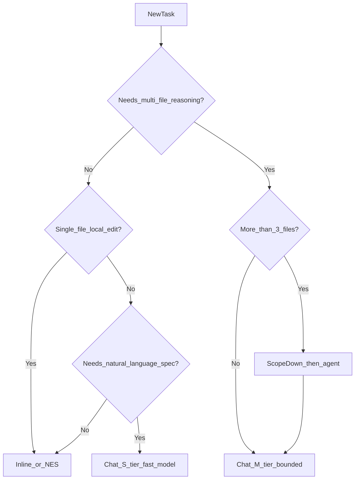

# Exercise 4: Chat vs Inline Completions Workflow

> **Category:** `cache-friendly`  
> **Skill:** Route work to the unlimited inline lane before spending pooled credits  
> **Supporting files:** none

## Scenario

Under UBB, **inline completions** and **next edit suggestions** do **not** consume GitHub AI Credits. Copilot Chat, agent mode, CLI, and code review do. Route work to the correct lane before you spend pooled credits.

---

## Decision tree



---

## Scenario matrix (Contoso.Retail)

| Task | Wrong lane | Right lane | Credit impact |
|------|------------|------------|---------------|
| Rename local variable in `CartService.ts` | Chat: "rename `qty` to `quantity` in this file" | Inline accept / NES | **Zero credits** |
| Add XML doc comment to one method | Chat with `@workspace` | Inline or select-method + Chat S | High vs **zero/low** |
| Implement 3-line null guard | Agent: "harden entire service" | Inline | Agent = **High** |
| Design Service Bus saga across 4 services | Inline | Chat M with **3 files** + follow-up thread | Medium, controlled |
| Explain 400-line file | Chat L + whole file | `#file` chunk + selection + Haiku | Medium → **Low** |

---

### Before (Token Wasteful / Non-Compliant)

> @workspace Rename all occurrences of `legacySku` to `canonicalSku` across the repo and explain your reasoning.

**Why wasteful:** Workspace scan pulls enormous context; Chat bills input tokens; inline would be free for single-file cases.

**Credit tier:** **High**

**Compliance:** **Risk** — workspace may surface unrelated files

---

### After (FinOps Clean / Enterprise Compliant)

> In the active editor only, rename `legacySku` → `canonicalSku` using the IDE refactor command. If cross-project rename is required, list candidate projects first (max 3), then run rename per project in separate bounded chats.

**Why:** Preserves cache, avoids workspace bleed, uses free inline where possible.

**Credit tier:** Before = **High** | After = **Low** (or zero for single-file inline)

**Compliance:** **Pass**

---

## Team policy snippet

```text
Default: Inline/NES → Chat (Haiku/Flash, ≤3 files) → Agent (approved, budgeted)
Frontier models: tech-lead approval + ticket ID in prompt
```
